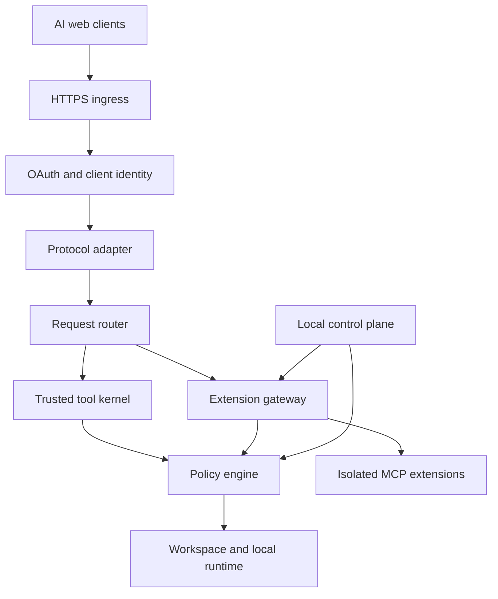
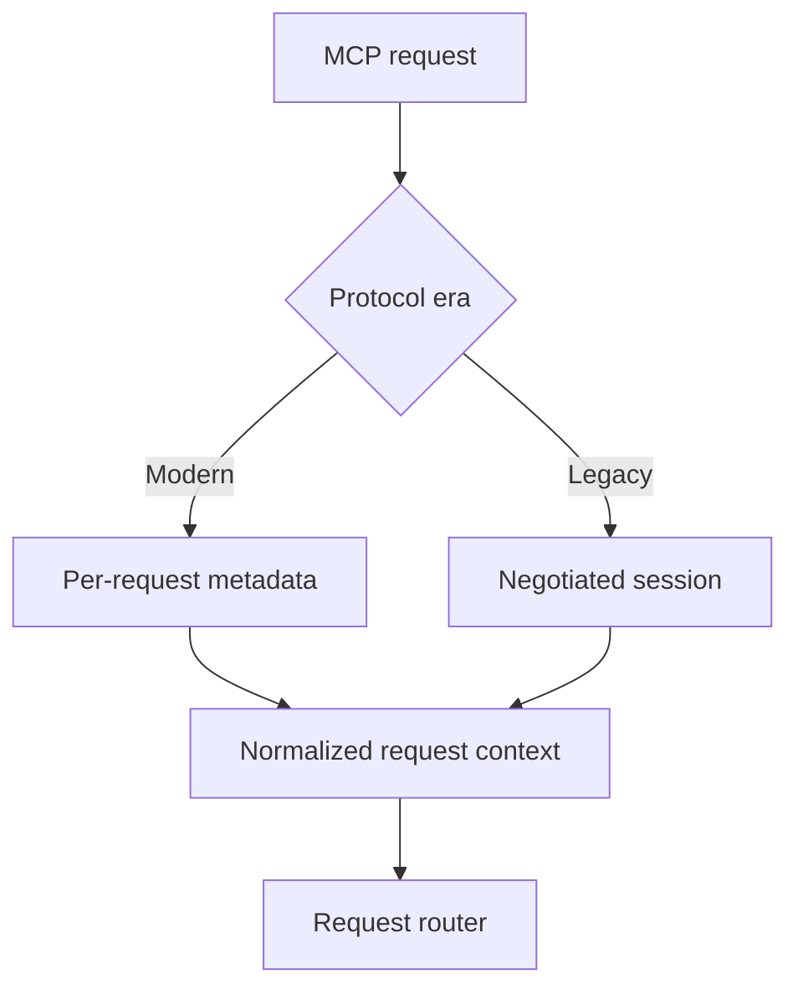
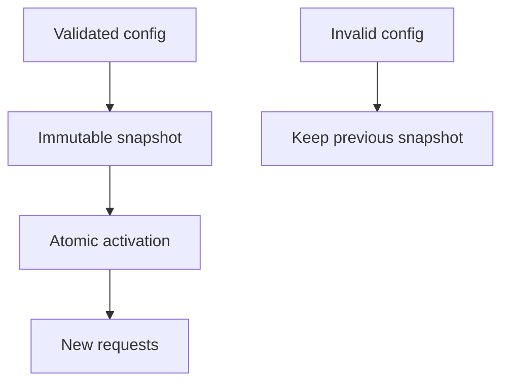
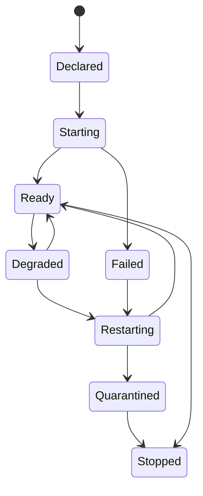
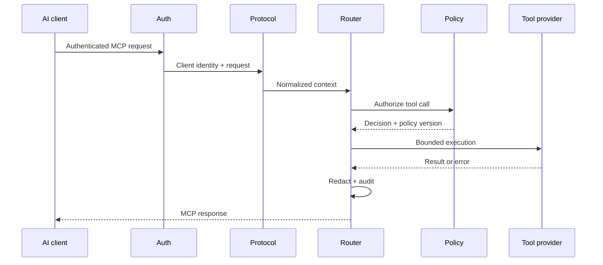
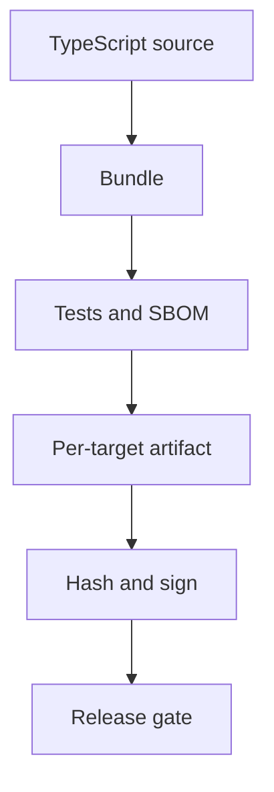

# SlncTrZ-MCP Architecture

> Status: active implementation architecture
> License: Apache-2.0  
> Core model: in-process trusted kernel plus isolated MCP extensions

## 1. Architectural objective

SlncTrZ-MCP exposes one stable MCP endpoint to AI web clients while keeping local capabilities controlled, observable, and extensible.

The architecture optimizes for:

- Low Latency in the trusted core.
- Strong isolation for third-party extensions.
- Stable tool identity.
- Modern and legacy MCP compatibility.
- Live policy changes without process restart.
- Standalone distribution without coupling packaging to business logic.
- A minimal Pi-inspired model-facing kernel.

## 2. System context



The ingress provider is replaceable. The trust boundary begins at OAuth and policy evaluation, not at the tunnel.

## 3. Architectural style

SlncTrZ-MCP uses a Hybrid Isolation Architecture.

### In-process

- HTTP and MCP transport.
- OAuth and client identity.
- Protocol compatibility adapters.
- Request router.
- Canonical Tool Registry.
- Policy Engine.
- Trusted minimal tools.
- Audit and redaction pipeline.
- Extension supervisor control logic.

### Out-of-process by default

- Third-party MCP servers.
- Python, Go, Rust, and external Node.js tools.
- Business-specific integrations.
- Tools requiring separate credentials.
- Experimental or high-risk capabilities.

This provides a small low-Latency core without accepting the blast radius of a complete monolith.

## 4. Major components

### 4.1 Ingress Adapter

Responsibilities:

- Bind to loopback or configured interface.
- Normalize forwarded origin and transport metadata.
- Enforce request size and connection limits.
- Provide health and readiness endpoints.
- Forward authenticated MCP traffic to the Protocol Adapter.

Non-responsibilities:

- Granting filesystem access.
- Selecting tools.
- Treating the tunnel provider as authentication.
- Serving the local control plane through the public route.

Supported edges are adapters, not core dependencies.

### 4.2 Authorization Server

Responsibilities:

- OAuth metadata.
- Authorization flow.
- PKCE.
- Dynamic client registration policy.
- Token issue, refresh, rotation, and revocation.
- Redirect URI validation.
- Client identity creation.
- Rate limiting and abuse protection.

All authorization decisions produce an immutable client identity context:

```ts
interface ClientIdentity {
  clientId: string;
  subjectId: string;
  authMethod: string;
  scopes: string[];
  issuedAt: number;
  tokenId: string;
}
```

Secrets are never passed into tool descriptions, logs, status files, URLs, or model-visible error messages.

Phase 2 implementation checkpoint (2026-08-26):

- Authorization code grants require PKCE S256 and exact redirect/resource binding.
- Public dynamic registration is rate-limited and bounded by an inactive-client eviction pool.
- Access tokens are short-lived; refresh tokens rotate; revocation invalidates the complete grant family.
- Authentication events use a structured, secret-free audit schema.
- Owner verifiers and static-client credentials are operating-system-protected runtime files.
- OAuth state is process-local and ephemeral: restart invalidates clients, grants, and tokens.
- The deployed gateway completed real-client OAuth discovery, authorization, token exchange,
  authenticated MCP dispatch, and `core.ping` verification.

See ADR-011, ADR-012, and ADR-013 for the accepted identity-state decisions.

### 4.3 Protocol Compatibility Adapter

SlncTrZ-MCP supports two protocol eras behind one internal request model.



Modern path:

- Protocol version, identity, and supported extensions are evaluated per request.
- No global first-client capability cache.
- Requests are independently routable.

Legacy path:

- Initialization is isolated by client and security context.
- Negotiated capabilities are stored in a bounded session record.
- Sessions have TTL, cancellation, shutdown, and cleanup.
- No session result is reused across unrelated clients.

Normalized internal context:

```ts
interface RequestContext {
  requestId: string;
  protocolVersion: string;
  client: ClientIdentity;
  workspaceId: string;
  capabilityProfile: string;
  policyVersion: string;
  deadline?: number;
  cancellationSignal: AbortSignal;
}
```

### 4.4 Request Router

Responsibilities:

- Resolve canonical tool identity.
- Capture the active Policy Snapshot.
- Enforce deadline, cancellation, queue, and concurrency limits.
- Route to the trusted kernel or extension adapter.
- Normalize result and error envelopes.
- Restore client-facing request identity without collision.
- Emit audit events.

The router does not contain tool-specific business logic.

### 4.5 Canonical Tool Registry

Canonical identities are independent of external naming syntax and runtime topology.

Examples:

```text
core.read
core.write
core.edit
core.exec
core.search
github.search_repositories
postgres.query
docker.inspect
```

Registry record:

```ts
interface ToolRecord {
  canonicalId: string;
  exposedName: string;
  providerId: string;
  riskClass: "read" | "write" | "execute" | "network" | "admin";
}
```

Rules:

- Collision is a configuration error.
- Renaming requires an explicit compatibility mapping.
- Declared tool-contract changes alter the deterministic registry/snapshot version;
  discovery-change notifications are deferred until the SDK contract is verified.
- Unhealthy providers do not silently resolve to another tool.
- Tool descriptions cannot grant permissions.

### 4.6 Minimal Tool Kernel

The default Pi-inspired profile consists of:

- `core.read`
- `core.write`
- `core.edit`
- `core.exec`

Optional read-only discovery:

- `core.search`

Optional typed filesystem operations:

- `core.mkdir`
- `core.move`
- `core.stat`

The model-facing surface remains small. Internal safety services may be more sophisticated without becoming additional tools.

Phase 3 filesystem checkpoint (2026-08-27):

- `core.read` performs strict UTF-8, handle-based, byte-bounded reads and returns a
  SHA-256 content identity for optimistic concurrency.
- `core.search` performs deterministic filename discovery bounded by depth, scanned
  entries, results, timeout, and cancellation.
- `core.write` is separately policy-authorized, absent without an explicit write root,
  and defaults to a non-mutating preview.
- Actual writes use same-directory temporary files, flush before publication, preserve
  existing modes, and require an expected SHA-256 before replacement.
- `core.edit` performs exact-match replacements against one base snapshot, rejecting
  missing, ambiguous, and overlapping matches, and never creates a file.
- All filesystem tools use one canonical boundary with intrinsic secret-path denial.
- Authenticated identity and scope are bound to one immutable policy snapshot per MCP
  exchange; write attempts emit attributed audit events without path or content.
- `core.exec` (Phase 3.1) runs operator-authored fixed-command definitions selected by
  `commandId`; it is POSIX-only, direct-spawn with no shell, uses a fixed minimal child
  environment, kills the full process group on timeout/abort, and reports a non-zero exit
  as a result. Windows is fail-closed until a separate Job Object ADR lands.

See `docs/THREAT_MODEL.md`, ADR-014, ADR-015, ADR-016, ADR-017, and ADR-018.

Phase 4 policy engine checkpoint (2026-08-27):

- The active policy is one immutable, versioned snapshot compiled from an operator-owned
  JSON document (`SLNCTRZ_POLICY_FILE`). An absent file compiles a deny-all snapshot.
- A request authenticates, validates workspace/profile selectors, captures one snapshot,
  and resolves one workspace bound to that principal before the MCP server is constructed.
- Profiles select capabilities (`read-only`, `minimal`, `custom`) and never fabricate
  absent roots or commands; multi-profile workspaces require explicit selection.
- Reload builds a candidate off to the side and atomically swaps the reference; a
  concurrent call returns `reload_in_progress`; a failed candidate retains the prior one.
- A risk-increasing change (adds a workspace/binding/profile/capability, broadens a root
  or child PATH/fixed environment, or removes a deny) defers to an approval hook. The
  default hook is unavailable, so it returns `approval_required` while preserving the
  prior snapshot. Access reductions activate without approval.
- Every startup compile and reload attempt emits exactly one secret-free `PolicyAuditEvent`
  (versions, counts, risk flag, result); a sink failure never undoes an activation.

Shared kernel services:

- Path Resolver.
- Atomic File Writer.
- Edit Engine.
- Command Parser.
- Output Truncator.
- Timeout and Cancellation Controller.
- Redaction Engine.
- Audit Emitter.

### 4.7 Policy Engine

The Policy Engine is the single authorization authority.



Policy dimensions:

- Client identity.
- Workspace.
- Capability profile.
- Tool risk class.
- Path and secret deny rules.
- Command and argument policy.
- Environment variables.
- Network destinations.
- Extension identity.
- Approval requirements.
- Time and resource limits.

Tools receive an already-authorized execution context. They do not independently parse policy files.

### 4.8 Workspace Boundary

Workspace configuration is explicit and default-deny.

Rules:

- No home-directory access by default.
- Secret directories have hard deny rules.
- Requested paths are canonicalized.
- Existing paths are resolved through real paths.
- New paths validate the nearest existing parent.
- Symlink escape is rejected.
- Cross-device and race-sensitive mutations receive platform-specific handling.
- Output cannot reveal denied absolute paths unnecessarily.

Write and execute composition:

- A writable workspace is not automatically executable.
- Trusted executable directories cannot overlap writable roots.
- Interpreters require explicit script-path authorization.
- Inline evaluation flags are denied unless separately approved.
- Network access is a separate capability.

### 4.9 Edit and Write Semantics

Write requirements:

- Explicit overwrite behavior.
- Size limits.
- Atomic temporary-file replacement where supported.
- Permission and ownership preservation policy.
- Safe failure cleanup.
- Optional expected-content hash for optimistic concurrency.

Edit requirements:

- Exact-match replacement only; fuzzy, regex, and unified-patch input are not phased.
- Ambiguous and overlapping matches fail closed.
- Dry-run diff (default) and explicit execution.
- Required expected base hash for both dry-run and execution.
- Deterministic resolution against one immutable base snapshot.
- Bounded structured diff that never splits a hunk.
- Preserved untouched bytes, line endings, and UTF-8 encoding.
- Atomic commit through the ADR-015 writer.

The system must not silently apply a fuzzy edit to the wrong location.

### 4.10 Command Execution

`core.exec` uses direct process spawning by default, not an implicit shell.

Execution policy separates:

- Binary.
- Subcommand.
- Arguments and flags.
- Working directory.
- Environment.
- stdin.
- Network.
- Timeout.
- Output limit.
- Executable trust zone.

Command classes:

| Class | Meaning |
| --- | --- |
| Inspect | No intended mutation |
| Metadata mutation | Changes repository/cache metadata |
| Workspace mutation | Changes user-visible files |
| Execute | Runs project or external code |
| Admin | Changes system or gateway configuration |

A command such as fetching repository metadata is not classified as read-only merely because it leaves the working tree unchanged.

### 4.10.1 Scoped developer access

A Developer Profile is a policy composition of explicit workspace roots and
operator-authored fixed commands; it is not a general shell or an implicit coding-agent
escape hatch. Risk-increasing profile, root, command, or binding changes require the
policy approval boundary. The current reload mechanism is internal and explicit: no
public data-plane reload tool, file watcher, owner CLI, or control-plane UI exists yet.

A full runtime sandbox is deliberately deferred. The baseline containment is a non-root
service account, explicit OS-level filesystem restrictions, policy roots, fixed command
execution, and audit. A sandbox becomes a required design gate before free-form command
execution, untrusted code, broad network access, or multi-tenant operation. See ADR-019.

### 4.11 Extension Gateway



Phase 5 implementation checkpoint (2026-08-27):

- One operator-owned policy document compiles extension manifests, the immutable canonical
  registry, workspace/profile grants, and the policy snapshot as one candidate.
- The registry is a neutral capability catalog. Only policy `extensionGrants` authorize a
  provider/tool/profile; manifests cannot self-grant workspace or tenant access.
- Every provider starts eagerly and must attest an exact canonical `tools/list` before it
  becomes discoverable. Malformed discovery or tool drift fails closed.
- Each MCP exchange captures one snapshot/runtime generation. Discovery is
  `authorized ∩ ready`; dispatch rechecks readiness and never falls back by name.
- Atomic reload rejects an invalid candidate and retains the active snapshot. A valid but
  non-activated candidate retires its eager runtime. After activation, the prior runtime
  drains active exchange leases before supervisors stop, preventing hybrid dispatch.
- Extension calls emit one bounded audit event containing attribution, canonical identity,
  risk, result, and duration only; arguments, output, endpoints, environment data,
  credential refs, manifest text, and raw errors are excluded.

Extension manifest includes:

- Provider ID and namespace.
- Transport.
- Executable or remote endpoint.
- Version.
- Environment allowlist.
- Opaque provider-scoped credential references.
- Fixed HTTPS endpoint for network providers.
- Startup and request timeout.
- Restart policy.
- Resource limits.
- Declared tools and risk classes.

Supervisor properties:

- Exponential backoff with jitter.
- Restart budget.
- Readiness probe.
- Graceful shutdown.
- Per-provider queue and circuit breaker.
- Output and message size limits.
- Quarantine after repeated failure.
- No automatic privilege expansion on restart.
- Readiness re-attestation after every start/restart.

The boundary is out-of-process execution and bounded protocol handling, not an OS
sandbox. Stdio children retain the operating-system permissions of the gateway service
identity; deployments must apply a restricted identity and external sandboxing before
accepting untrusted code or broad filesystem/network authority.

### 4.12 Project Instructions

Project instructions are context, not authority.

Precedence:

1. Product safety rules.
2. Administrator policy.
3. User configuration.
4. Workspace instructions.
5. Directory-local instructions.

Higher-level safety and policy cannot be overridden by lower-level files.

Each context contribution records:

- Source path.
- Content hash.
- Version or modification time.
- Applied precedence.
- Loaded or referenced status.
- Token cost.

Large content should be selectively loaded or referenced. The system must not repeatedly inject the same document without a context-budget decision.

### 4.13 Audit and Observability

Audit event:

```ts
interface AuditEvent {
  timestamp: string;
  requestId: string;
  clientId: string;
  workspaceId: string;
  toolId: string;
  riskClass: string;
  policyVersion: string;
  decision: "allow" | "deny" | "approve";
  result: "success" | "error" | "cancelled" | "timeout";
  durationMs: number;
}
```

Never record:

- Passwords.
- Access or refresh tokens.
- Passphrases.
- Secret environment values.
- Full sensitive file content.
- Raw authorization headers.

Metrics:

- P50/P95/P99 Latency.
- Active and queued requests.
- Tool error rate.
- Extension restart and quarantine count.
- Policy reload duration.
- Memory and CPU.
- Output truncation.
- Authentication and authorization failures.

### 4.14 Local Control Plane

The control plane binds to loopback by default.

Functions:

- Manage workspaces.
- Select capability profiles.
- Approve policy changes.
- Inspect extension health.
- Revoke clients and tokens.
- View redacted audit events.
- Validate configuration before activation.
- Export diagnostics without secrets.

The data-plane public endpoint must not route to control-plane assets or APIs.

## 5. Runtime data flow



No tool executes before the policy decision. The captured policy version remains attached to the request even if configuration changes during execution.

## 6. Process topology

```text
slnctrz-mcp
├── Core process
│   ├── ingress
│   ├── authorization
│   ├── protocol adapters
│   ├── request router
│   ├── policy engine
│   ├── tool registry
│   ├── minimal kernel
│   ├── extension supervisor
│   └── audit/metrics
└── Isolated providers
    ├── MCP child process A
    ├── MCP child process B
    └── remote MCP endpoint C
```

One core process is a deployment default, not a shared-state requirement. Stateless modern requests can later be scaled horizontally if storage and routing are externalized.

## 7. Configuration model

Suggested files:

```text
config/
├── gateway.yaml
├── workspaces.yaml
├── policies.yaml
└── extensions/
    ├── github.yaml
    ├── postgres.yaml
    └── docker.yaml
```

Secrets are referenced by opaque identifier, not stored inline:

```yaml
credentials:
  ref: os-keychain://slnctrz/github-main
```

Configuration lifecycle:

1. Parse.
2. Validate schema.
3. Resolve references without exposing values.
4. Check namespace and policy conflicts.
5. Build immutable snapshot.
6. Dry-run extension changes.
7. Require approval when risk increases.
8. Atomically activate.
9. Emit redacted change event.

## 8. Packaging architecture

Packaging is outside the runtime domain boundary.



Developer mode:

- Repository checkout.
- Node.js and package manager.
- Fast rebuild and test workflow.
- No standalone-specific branches in core business logic.

Standalone mode:

- Self-contained runtime or single executable.
- Versioned user-data and installation directories.
- Pinned updates.
- Checksum verification.
- Atomic activation and rollback.
- No system-wide runtime installation.

Node SEA is an implementation candidate, not an architectural dependency. The prototype must prove asset loading, ESM behavior, external provider spawning, signing, update, and cross-platform operation.

## 9. Failure model

| Failure | Required behavior |
| --- | --- |
| Invalid configuration | Keep previous valid snapshot |
| OAuth store unavailable | Fail closed |
| Policy Engine unavailable | Deny execution |
| Core tool timeout | Cancel and return bounded error |
| Extension crash | Mark unavailable, apply restart policy |
| Repeated extension crash | Quarantine |
| Audit sink unavailable | Follow configured fail-open/fail-closed rule; security events default fail-closed |
| Client disconnect | Cancel work where safe |
| Output exceeds limit | Truncate deterministically and mark result |
| Protocol mismatch | Return explicit compatibility error |
| Update failure | Keep previous installed version |

## 10. Scalability model

Vertical:

- One core process.
- Bounded concurrency.
- Per-provider queues.
- Worker isolation for CPU-heavy first-party work.
- Child processes for external providers.

Horizontal future path:

- Stateless modern request routing.
- External token/session store.
- Shared configuration version.
- Distributed extension placement.
- Consistent workspace ownership.
- Central audit sink.

Horizontal scaling is not required for the first release, but global in-memory client negotiation must not make it impossible.

## 11. Security invariants

1. No request executes without authenticated identity and policy decision.
2. No workspace is allowed implicitly.
3. Secret deny rules override allow rules.
4. Writable paths do not imply executable trust.
5. Extension credentials are least-privilege and provider-scoped.
6. Untrusted extensions do not execute in the core process.
7. Client sessions and capability negotiation are not shared across security contexts.
8. Tool names cannot collide silently.
9. Configuration activation is atomic.
10. Logs and errors never disclose credentials.
11. Instruction files cannot grant capabilities.
12. Public ingress cannot reach the local control plane.

## 12. Architecture verification

Required test families:

- MCP modern/legacy compatibility.
- OAuth and client isolation.
- Path traversal and symlink escape.
- Write/execute composition.
- Policy snapshot consistency.
- Tool registry collision.
- Extension crash and restart.
- Cancellation and timeout.
- Output truncation and redaction.
- Config rollback.
- Multi-client concurrency.
- Packaging and upgrade.
- Secret scanning.
- Failure injection.

Performance evidence must separate:

- Node/runtime baseline.
- MCP SDK baseline.
- Core modules.
- Each extension.
- Auth and policy overhead.
- Transport and ingress overhead.

## 13. Consequences

Benefits:

- Small, understandable trusted kernel.
- Low core Latency.
- Stronger extension isolation.
- Better Scalability than a shared-session monolith.
- Stable model-facing tool surface.
- Live configuration without connector restart.
- Packaging can evolve independently.

Costs:

- Supervisor and policy implementation are non-trivial.
- Dual-era protocol support increases test scope.
- Cross-platform isolation differs by operating system.
- Standalone child-process support complicates SEA packaging.
- Strong audit and redaction require disciplined schemas.

These costs are accepted because they directly protect security, compatibility, and long-term adaptability.
