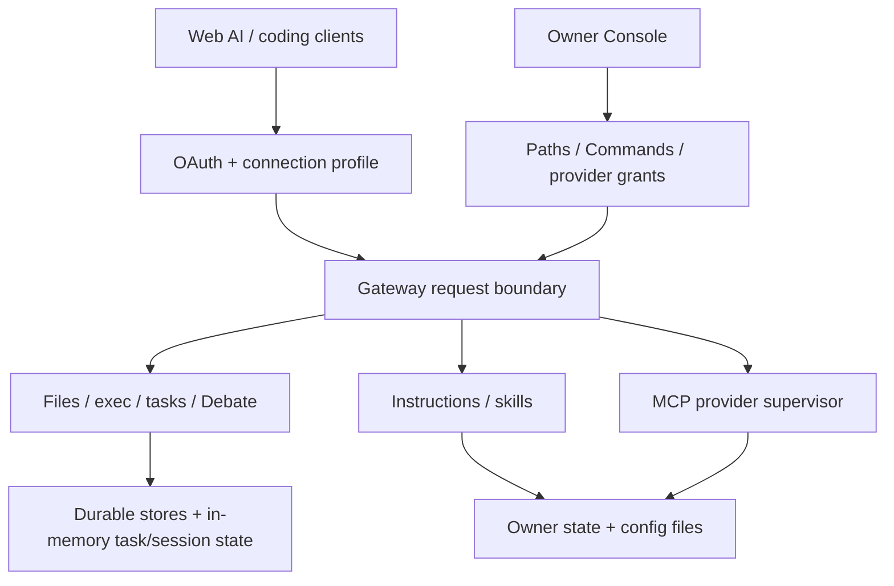

# SlncTrZ-MCP Architecture

The gateway gives authenticated Web AI and coding clients owner-controlled access to one
Linux or Windows account. This guide describes published v0.4.2's product boundaries;
unreleased development changes and runtime observations are separate facts in
[Project Status](docs/PROJECT_STATUS.md).

## 1. System Overview

Use one endpoint to connect AI clients, select a profile through OAuth, and apply the
Owner's access policy before reaching coding tools or downstream providers.

```mermaid
flowchart TD
  Clients["Web AI / coding clients"] --> OAuth["OAuth + connection profile"]
  Owner["Owner Console"] --> Policy["Paths / Commands / provider grants"]
  OAuth --> Kernel["Gateway request boundary"]
  Policy --> Kernel
  Kernel --> Core["Files / exec / tasks / Debate"]
  Kernel --> Harness["Instructions / skills"]
  Kernel --> Providers["MCP provider supervisor"]
  Harness --> Files["Owner state + config files"]
  Providers --> Files
  Core --> Stores["Durable stores + in-memory task/session state"]
```

The MCP endpoint is `:3100/mcp`; the same HTTP listener serves the optional Owner homepage,
`/owner`, `/debate` and `/usage`. A separate loopback control plane defaults to port 3101.

| Component            | Responsibility                                                | Authority / persistence                                                        |
| -------------------- | ------------------------------------------------------------- | ------------------------------------------------------------------------------ |
| OAuth server         | PKCE, exact redirect/resource binding, consent and refresh    | Durable client/grant state; pending authorization transactions/codes in memory |
| Policy engine        | Paths, command catalog, provider grants and autonomy          | Owner-managed files; immutable per-request snapshots                           |
| Context service      | Product Agent Harness, instructions, progressive skills       | Principal/workspace/revision-bound four-hour receipts in memory                |
| Core tools           | Text/image inspection, atomic file changes, bounded execution | Current policy and gateway OS account                                          |
| Managed Task Runtime | Background Runner and logical Task Coordinator                | In-memory; Runner creator-private, Coordinator workspace-visible               |
| Debate               | Two-participant turn/sequence coordination                    | Durable SQLite history                                                         |
| Provider supervisor  | STDIO children or remote Streamable HTTP endpoints            | Per-provider isolation, deadlines, recovery budgets                            |
| Usage / audit        | Numeric traffic estimates and bounded event records           | Separate SQLite stores; no prompt/argument/output capture in Usage             |
| Standalone product   | Setup, verified update, rollback, doctor and uninstall        | Managed install/state/config roots                                             |
| Lifecycle ledger     | Append-only operation records and identity comparison         | Foundation module; not wired into this gateway runtime                         |

The owner controls Autonomy, Paths, Commands and MCP Servers. Restricted file tools enforce
configured Paths and protected-name rules. Restricted execution authorizes catalog binaries;
allowing a shell/interpreter gives that executable the OS account's powers. Autonomous mode
uses that account's authority directly. Neither mode supplies an OS sandbox or silent elevation.

Full exposes available coding/context/task surfaces. Gateway-only hides those surfaces and
retains `core.ping`, `connection.restrict`, Debate and enabled provider tools. Provider authority
is a separate boundary; hiding gateway tools does not sandbox a provider.

## 2. Core Components

### Core Tools

- `core.ping`: Running identity, profile, capability inventory and embedded model guidance.
- `core.read`, `core.search`: Scoped text inspection; search is case-insensitive.
- `media.read_image`: Original bounded PNG/JPEG bytes under file-read authority.
- `core.write`, `core.edit`: Atomic updates; explicit `dryRun:true` previews without applying.
- `core.exec`: Direct platform-native execution with cwd, timeout and output bounds.

### Coding Context & Skills

`context.bootstrap` returns global instructions, optional authorized project instructions,
catalog metadata and a context receipt. `skills.read` activates one skill before its resources
are read. Instruction/skill changes, policy changes, expiry or restart require a new receipt.
Instructions remain guidance and do not grant capabilities.

Fresh provisioning embeds/seeds `code-review` and `debug-and-test` only. Other repository skills
can be discovered from an explicit projectRoot or installed into the owner-managed harness.
See [Harness](docs/HARNESS.md) for discovery paths and size limits.

### Managed Task Runtime

`task.start` starts one policy-authorized background command; `task.get`, `task.wait` and
`task.cancel` manage its creator-private Runner record. `task.create` creates a logical
coordination task; another authenticated client in the same workspace may claim it.
Claiming a task does not start a process or increase permissions. State is in-memory and
clears on restart; clients reconcile prior effects before recreating work.

### Extension & Provider Supervisor

STDIO adapters supervise child processes; Streamable HTTP adapters connect to remote
endpoints. Modern `server/discover` negotiation falls back to supported legacy initialization.
The catalog namespaces exposed tools by provider ID and has a catalog Fingerprinting field.
No CAD/CyberBrain provider is bundled or guaranteed available merely because it is named here.

Calls are bounded and are not automatically replayed after failure. Failures are bounded:
recurrent `session_invalid`
incidents are additionally bounded by a rolling incident budget. Credential rotation stages
a new opaque ref and attempts transactional activation/rollback; it is not a zero-downtime guarantee.

### Operations & Lifecycle

Graceful application shutdown handles SIGTERM/SIGINT, closes servers/stores and requests
termination of managed child runners. It cannot promise cleanup after forced process kill,
OS failure or actions performed independently by a remote provider.

`src/lifecycle/operation-ledger.ts` is intentionally unwired: it registers no MCP tools,
does not make Task Runtime durable and does not control CAD applications. Its proposed
integration points are in [Lifecycle Wiring](docs/LIFECYCLE_WIRING.md).

New Gateway-only consents use durable grants and rotating single-use refresh tokens until
revocation. Existing finite grants stay finite during OAuth schema-v3 migration. Restore a
coherent pre-migration backup before rollback to a pre-v3 binary; see [Backup](docs/BACKUP_RESTORE.md).

## 3. Extend and operate the product

| You want to…                   | Extension point                                              | Check the result                                                 |
| ------------------------------ | ------------------------------------------------------------ | ---------------------------------------------------------------- |
| Add an existing MCP server     | Owner MCP Servers; STDIO command or remote HTTP endpoint     | Test/Sync, inspect readiness, refresh client discovery           |
| Add a working skill            | Owner harness or authorized project `skills/<name>/SKILL.md` | Bootstrap that project, inspect catalog, then read the skill     |
| Implement a gateway capability | Contributor source modules and MCP registrations             | Contract/security tests and exact native artifact acceptance     |
| Move or upgrade a gateway      | Managed program, config and state roots                      | Coherent backup, compatible schemas, status/doctor after restart |

Adding a provider does not require changing the kernel. Adding a skill adds guidance, not
new OS permissions or a tool implementation. A renamed connection/display label does not
change the underlying authorization boundary.

State/config paths depend on OS and install mode; inspect them with `config show`.
Keep owner/provider credential state private and include it only in protected backups.
Back up state/config together while stopped. Replace the program through verified update;
binary-only rollback does not undo a database migration.

See [MCP Servers](MCP_SERVERS.md), [Harness](docs/HARNESS.md),
[Update/rollback commands](docs/USER_GUIDE.md#2-cli-commands) and
[Backup and Restore](docs/BACKUP_RESTORE.md). Latency and Scalability improvements need
measurements under stated load; the diagram is not a claim of horizontal multi-process support.
