# SlncTrZ-MCP

**Let AI work with your real files, commands and MCP servers — from the chat or coding agent you already use.**

SlncTrZ-MCP is a self-hosted gateway for Linux and Windows. Connect once, choose what the
AI can access, and work with your projects through one MCP endpoint.

<p align="center">
  
</p>

<p align="center">
  <a href="docs/USER_GUIDE.md">User Guide</a> · <a href="https://github.com/SlncTrZ/SlncTrZ-MCP/releases">Releases</a>
</p>

## What can you do?

| You want to…                               | SlncTrZ-MCP provides                                                                 |
| ------------------------------------------ | ------------------------------------------------------------------------------------ |
| Work with a local project from Web AI      | Read, search and edit files; run authorized commands                                 |
| Bring your working habits to the agent     | Built-in working guidance, global/project instructions and skills loaded when needed |
| Use several MCP servers from one client    | One endpoint and a consistent tool contract                                          |
| Keep a coding agent's own harness          | Gateway-only: provider tools and Debate, with native OAuth                           |
| Compare ideas or share work between agents | Native two-agent Debate and task coordination                                        |
| Keep control of your machine               | Owner Console for Paths, Commands, MCP servers and connections                       |

Use **Full** for the gateway's coding tools and harness. Use **Gateway-only** when OpenCode,
Pi, Codex or Claude Code already handles local coding and you only need shared MCP providers.
Choose Gateway-only on the first OAuth approval: the grant lasts until revoked and cannot
be promoted to Full. Compatible clients handle rotating refresh tokens. See [Connect coding agents](docs/GATEWAY_ONLY.md).

The **built-in harness** supplies product working guidance to Full connections. Fresh installs
also seed the **code-review** and **debug-and-test** skills, preserving existing owner files.
Instructions and skills load progressively through `context.bootstrap` and `skills.read`;
additional repository skills are discovered for an authorized project or installed explicitly.
See [Harness & Skills](docs/HARNESS.md) and [bundled defaults](skills/README.md).
Gateway-only clients keep their own harness.

## Why use a gateway?

Keep your projects and provider configuration on your machine while choosing the AI client
that works for each task. A Web AI can use the Full profile to work on an authorized project;
a coding agent can use Gateway-only to share providers without replacing its own tools.

You control access in one Owner Console. Add providers or skills when needed, and back up
your configuration and state when moving or updating the gateway. Your AI platform's plans,
usage limits and billing still apply; the gateway does not increase those allowances.

## Quick start

**Linux x64:** use a terminal. **Windows x64:** use Git Bash for setup.

```bash
curl --fail --location --proto '=https' --tlsv1.2 \
  https://github.com/SlncTrZ/SlncTrZ-MCP/releases/latest/download/install.sh \
  --output /tmp/slnctrz-install.sh

sh /tmp/slnctrz-install.sh --mode user --port 3100 --path "$HOME/projects"
```

Replace the last path with an **existing** project directory. On Windows, use an absolute
Git Bash path such as `/c/Users/YourName/projects`.

1. Run the **Start:** command printed by setup. Windows can run its installed executable
   from PowerShell; Linux uses the printed launcher/config command.
2. Open the **Owner Console** at `http://127.0.0.1:3100/`. Read the Owner passphrase privately
   from the file identified by setup and enter it only in the Console/consent page.
3. Review Paths, Commands and MCP Servers, then connect your client to
   `http://127.0.0.1:3100/mcp` and complete OAuth.
4. Ask the client to call `core.ping`; check the gateway identity, profile and available tools.

For a cloud AI, use a reachable HTTPS endpoint and the
[AI Web connection steps](docs/USER_GUIDE.md#connect-an-ai-web-client).
Installed binaries include their runtime; Node.js is only needed for source development.

[Linux and Windows steps](docs/USER_GUIDE.md#1-installation--endpoints) ·
[OpenCode / Pi / Codex / Claude Code](docs/GATEWAY_ONLY.md) ·
[HTTPS / Linux system service](docs/DEPLOYMENT.md)

## Know the boundaries

- **Restricted** uses configured Paths and Commands. **Autonomous** uses the gateway OS account's permissions.
- An authorized shell or interpreter can exercise that account's permissions; Restricted is a capability policy, not a full OS sandbox.
- Gateway-only limits gateway tools. It does not sandbox provider tools or the coding agent's own tools.
- OAuth connections and Debate history persist. Task state and context receipts reset on restart.
- The usage dashboard estimates gateway traffic; it does not measure your platform allowance or bill.

See [Security](SECURITY.md) and [Backup and Restore](docs/BACKUP_RESTORE.md).

## Documentation

| Need                                  | Start here                                                        |
| ------------------------------------- | ----------------------------------------------------------------- |
| Install, connect and use the gateway  | [User Guide](docs/USER_GUIDE.md)                                  |
| Native OAuth for coding agents        | [Gateway-only](docs/GATEWAY_ONLY.md)                              |
| Add MCP providers or custom skills    | [MCP Servers](MCP_SERVERS.md) · [Harness](docs/HARNESS.md)        |
| Diagnose or update an installation    | [Troubleshooting](docs/TROUBLESHOOTING.md)                        |
| Contribute or inspect the design      | [Contributing](CONTRIBUTING.md) · [Architecture](ARCHITECTURE.md) |
| Planned upgrades and release evidence | [Plan](PLAN.md) · [Release Notes](docs/releases/v0.4.5.md)        |
| Browse all documentation              | [Documentation index](docs/README.md)                             |

Linux x64 and Windows x64 are the standalone release targets. This tree prepares
[v0.4.5](docs/releases/v0.4.5.md); publication becomes stable only after the signed
release workflow passes its public installation and browser gates. Check the
[latest published release](https://github.com/SlncTrZ/SlncTrZ-MCP/releases/latest)
for current availability. Source, published release and running process are separate
identities; see [Project Status](docs/PROJECT_STATUS.md).

## Development

Requires Node `>=22.13.0 <25`.

```bash
npm ci
npm run check
npm run build
```

Apache-2.0. See [LICENSE](LICENSE).
